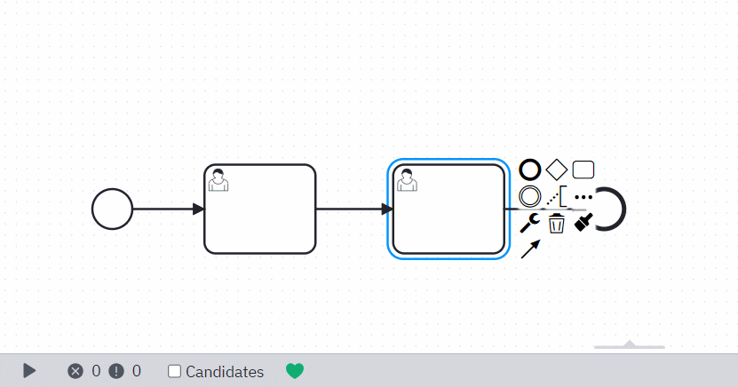

# Camunda Modeler Roles Without Swimlanes Plugin

---

 

## Description

This plugin adds badges above User Tasks and shows information about task's candidate groups.

## How to use

After installing the plugin, a new feature will be seamlessly integrated into the Camunda Modeler interface. Located on the left side of the bottom panel, the **Candidates** checkbox allows you to effortlessly toggle the display of badges. These badges automatically update with the latest information.

In cases where there are numerous candidate groups, the text within the badges will be trimmed and hidden. To view all the groups, simply hover over the badge, revealing the complete set of information.

## How to install

- Pull this repository and copy into the `plugins` folder of the Camunda Modeler
- Start the Camunda Modeler
- Select the **Candidates** checkbox and add some groups to the User Task
